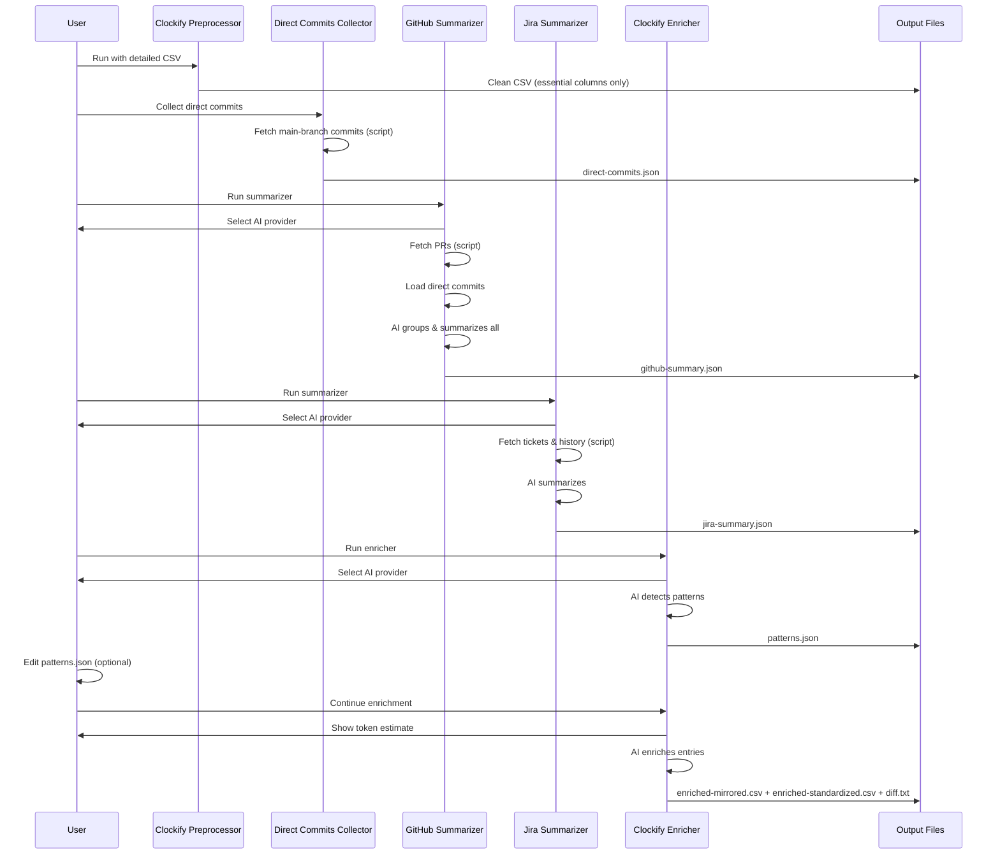

## Overview

This document describes the user flows for the Clockify Time Record Enrichment tool. The tool consists of five separate CLI tools that work together to enrich time-tracking records using GitHub and Jira data.

> Note: This is a CLI-first product. This document intentionally includes a small amount of operational detail (e.g., output filenames) because those details shape the user experience. Deep implementation details belong in the Tech Plan.



---

## Flow 1: Initial Setup

**Description**: First-time configuration of the tool

**Trigger**: User clones the repository and wants to use the tool

**Steps**:

1. User copies `config.example.json` to `config.json`
2. User edits `config.json` with their credentials:

- GitHub personal access token, repo details, date range
- **Developer email(s)** (optional - if not provided, will fetch from GitHub API)
- **Main branch name** (optional, default: `develop`)
- Jira API token, base URL, project keys, date range
- Clockify input/output file paths

3. User places their Clockify detailed export CSV in `input/` folder
4. User reviews `cli-providers/` folder to see available AI providers:

- Pre-configured: `claude-opus.js`, `claude-sonnet.js`, `claude-haiku.js`, `gemini-pro.js`, `gemini-flash.js`
- User can add custom provider scripts if needed

5. Setup complete - ready to run tools

**Configuration Note**:

- `developer_emails` in config.json is used to filter commits/PRs to only yours (recommended as a list)
- If `developer_emails` is not provided, tool will fetch authenticated user's email from GitHub API and use that single email
- Recommended to set explicitly if you use multiple emails for commits
- `main_branch` is configurable (default: `develop`) and is used for collecting direct commits

**Exit**: User is ready to run the preprocessing flow

---

## Flow 2: Clockify Preprocessing

**Description**: Clean the detailed Clockify CSV export to remove unnecessary columns

**Trigger**: User runs `node clockify-preprocessor.js` (optionally with `--input path/to/file.csv` or `--force-refresh`)

**Steps**:

1. Tool checks if input CSV exists (CLI args override config.json)
2. Tool validates CSV has required columns:

- Description, Start Date, Start Time, End Date, End Time, Duration (h)

3. If missing columns, show error: "CSV missing required columns: [list]. Export detailed report from Clockify."
4. Tool removes unnecessary columns:

- Project, Client, Task, Kiosk, User, Group, Email, Tags, Billable, Date of creation, Duration (decimal)

5. Tool writes cleaned CSV to `cache/clockify-cleaned.csv`
6. Show summary: "Processed 150 entries. Output: cache/clockify-cleaned.csv"

**CLI Flags**:

- `--input <path>`: Override input CSV path from config
- `--force-refresh`: Clear cached preprocessed output and reprocess input CSV

**Exit**: Cleaned CSV ready for enrichment

---

## Flow 3: Direct Commits Collection

**Description**: Collect all developer commits present on the configured main branch (default: `develop`) (classification happens later)

**Trigger**: User runs `node collect-direct-commits.js` (optionally with `--force-refresh`)

**Steps**:

1. If `--force-refresh` flag provided, clear `cache/direct-commits.json`
2. Tool checks for `config.json`, validates GitHub credentials
3. Tool determines developer identity:

- If `developer_emails` in config, use them
- Otherwise, fetch authenticated user's email from GitHub API and use it as the only email
- Show: "Filtering commits by: [user@example.com](mailto:user@example.com)"

4. Tool fetches all commits on the configured main branch in configured date range
5. Show progress: "Fetching commits... 150/500"
6. Tool filters commits:

- Only commits by the developer (matching configured email(s))

- Note: this tool does not attempt to detect PR association; the GitHub Summarizer subtracts PR-associated SHAs later (PR commit SHAs + PR merge commit SHAs)

7. Show progress: "Filtering direct commits... 150/500"
8. Tool saves raw commit data to `cache/direct-commits.json`:

```json
[
  {
    "sha": "abc123",
    "date": "2024-03-15T14:30:00Z",
    "message": "fix auth bug",
    "files_changed": ["src/auth/login.js", "src/auth/session.js"],
    "lines_added": 15,
    "lines_removed": 8
  }
]
```

9. Show summary: "Collected developer commits from main branch. Output: cache/direct-commits.json"

**Note**: This is a pure script - no AI involved. Just data collection.

**CLI Flags**:

- `--force-refresh`: Clear cache and fetch fresh data from GitHub

**Exit**: Direct commits JSON ready for GitHub summarizer

---

## Flow 4: GitHub Summarization

**Description**: Fetch PRs, load direct commits, and use AI to group and summarize all GitHub activity

**Trigger**: User runs `node github-summarizer.js` (optionally with `--force-refresh`)

**Steps**:

1. If `--force-refresh` flag provided, clear `cache/github-summary.json`
2. Tool checks for `config.json`, validates GitHub credentials
3. Tool checks for `cache/direct-commits.json`

- If missing, warn: "Run collect-direct-commits.js first for complete data"
- User can choose to continue without direct commits or exit

4. Tool lists available AI providers from `cli-providers/` folder
5. Prompt user: "Select AI provider: 1) claude-opus 2) claude-sonnet 3) gemini-pro..."
6. User selects provider (e.g., "2" for claude-sonnet)
7. **Script phase**: Tool fetches PRs merged in the configured date range from GitHub (using Search API for completeness)
8. **Script phase**: Tool filters PRs to "only mine" by requiring that the PR contains at least one commit authored by `developer_emails` (from config, with API fallback if missing)
9. **Script phase**: Tool fetches per-PR details (commits, file changes, review iterations) for the filtered PR set
10. Show progress: "Fetching PRs... 25/50"
11. If no PRs found, prompt: "No GitHub PRs found in date range. Continue anyway? (y/n)"

- If user chooses "n", exit with message to check config
- If user chooses "y", continue with only direct commits

12. For each PR, fetch commits, file changes, review iterations (script-based)
13. **Script phase**: Tool loads direct commits from cache
14. Show: "Loaded main-branch developer commits from cache"
15. **Script phase**: Tool subtracts PR-associated SHAs (PR commit SHAs + PR merge commit SHAs) from the cached commit list to isolate direct-commit candidates
16. **AI phase**: Tool sends remaining commits to AI for semantic grouping
17. Show progress: "AI grouping direct commits..."
18. AI groups related direct commits together (e.g., commits touching same feature/bug)
19. **AI phase**: For each PR and each commit group, call AI to generate `ai_description`:

- Input: commit messages, files changed, modules touched, complexity signals
  - Output: Concise description of what was actually built

20. Show progress: "Summarizing PRs and commit groups... 30/65"
21. Save results to `cache/github-summary.json` (includes both PRs and grouped direct commits)
22. Show summary: "Processed 50 PRs and 15 commit groups (from 45 direct commits). Output: cache/github-summary.json"

**Error Handling**:

- If API fails mid-process, save progress to cache
- On next run (without --force-refresh), prompt: "Found partial cache. Resume or start fresh? (r/s)"
- If user chooses resume, continue from last successful PR

**CLI Flags**:

- `--force-refresh`: Clear cache and fetch fresh data from GitHub

**Note**:

- Script handles data collection (PRs, commits)
- AI handles grouping and summarization
- This separation keeps costs down while maintaining quality

**Exit**: GitHub summary JSON ready for enrichment

---

## Flow 5: Jira Summarization

**Description**: Fetch Jira ticket data and use AI to summarize

**Trigger**: User runs `node jira-summarizer.js` (optionally with `--force-refresh`)

**Steps**:

1. If `--force-refresh` flag provided, clear `cache/jira-summary.json`
2. Tool checks for `config.json`, validates Jira credentials
3. Tool lists available AI providers from `cli-providers/` folder
4. Prompt user: "Select AI provider: 1) claude-opus 2) claude-sonnet 3) gemini-pro..."
5. User selects provider (e.g., "3" for gemini-pro)
6. **Script phase**: Tool fetches tickets from Jira API
7. Show progress: "Fetching tickets... 30/75"
8. If no tickets found, prompt: "No Jira tickets found in date range. Continue anyway? (y/n)"

- If user chooses "n", exit with message to check config
- If user chooses "y", create empty summary file and continue

9. **Script phase**: For each ticket, fetch (no AI):

- Basic info (title, type, story points, status)
- Status history (transitions, back-to-development count)
- Comments (only if back-to-dev ≥ 1 or total hours > 10)

10. **AI phase**: For each ticket, call AI to summarize:

- Description (compressed to ~150 words)
  - Comments (if fetched, compressed to ~100 words)

11. Show progress: "Summarizing tickets... 30/75"
12. Save results to `cache/jira-summary.json`
13. Show summary: "Processed 75 tickets. Output: cache/jira-summary.json"

**Error Handling**:

- If API fails mid-process, save progress to cache
- On next run (without --force-refresh), prompt: "Found partial cache. Resume or start fresh? (r/s)"
- If user chooses resume, continue from last successful ticket

**CLI Flags**:

- `--force-refresh`: Clear cache and fetch fresh data from Jira

**Note**:

- Script handles data fetching
- AI handles summarization for quality
- Compression helps reduce token usage in later enrichment step

**Exit**: Jira summary JSON ready for enrichment

---

## Flow 6: Pattern Detection (Pre-Enrichment)

**Description**: Use AI to detect common patterns in Clockify entries for user to standardize

**Trigger**: User runs `node clockify-enricher.js` (first phase, optionally with `--force-refresh`)

**Steps**:

1. If `--force-refresh` flag provided, clear all caches (GitHub, Jira, patterns, enrichment)
2. Tool checks for required inputs:

- `cache/clockify-cleaned.csv`
- `cache/github-summary.json`
- `cache/jira-summary.json`

3. If any missing, block with error: "Run [tool-name] first. See README for workflow order."
4. Tool detects Clockify date range from CSV
5. Tool compares with GitHub/Jira date ranges from config
6. If mismatch detected, show:

```
 Date range mismatch detected:
 - Clockify entries: 2023-12-01 to 2024-06-15
 - GitHub configured: 2024-01-01 to 2024-06-01
 - Jira configured: 2024-01-01 to 2024-06-01

 Update config.json to match Clockify range? (y/n)
```

7. If user chooses "y", update config.json and prompt to re-run summarizers
8. If user chooses "n", continue with warning about potential low-confidence entries
9. Tool lists available AI providers from `cli-providers/` folder
10. Prompt user: "Select AI provider: 1) claude-opus 2) claude-sonnet 3) gemini-pro..."
11. User selects provider (e.g., "2" for claude-sonnet)
12. Tool analyzes all Clockify descriptions to find patterns:

- Common task types (e.g., "Build", "Generate build", "Create build")
  - Recurring activities (e.g., "Daily Standup", "Standup", "Daily sync")
  - Similar phrasing across entries

13. Tool generates `cache/patterns.json`:

```json
{
  "build_tasks": {
    "variants": ["Build", "Generate build", "Create build", "Make build"],
    "suggested_standard": "Generate build",
    "count": 15
  },
  "standup_tasks": {
    "variants": ["Daily Standup", "Standup", "Daily sync"],
    "suggested_standard": "Daily Standup",
    "count": 45
  }
}
```

14. Show detected patterns summary
15. Prompt: "Accept these patterns? (y/n)"

- If "y": Continue immediately to enrichment (Flow 7)
  - If "n": Show message "Edit cache/patterns.json and run enricher again", then exit

**CLI Flags**:

- `--force-refresh`: Clear all caches and start fresh

**Note**:

- AI analyzes patterns for quality (better than regex)
- User has final say on standardization

**Exit**: Either continues to enrichment (if patterns accepted) or waits for user to edit patterns.json

---

## Flow 7: Clockify Enrichment

**Description**: Enrich Clockify entries using GitHub/Jira data and user-approved patterns

**Trigger**: Automatically continues from Flow 6 if patterns accepted, OR user runs `node clockify-enricher.js` after editing patterns.json

**Steps**:

1. Tool detects `cache/patterns.json` exists (user has reviewed it)
2. Tool loads all inputs: cleaned CSV, GitHub summary, Jira summary, patterns
3. Tool estimates token usage for enrichment:

- Count entries to enrich
- Estimate tokens per entry based on available data
- Calculate total tokens

4. Show estimate: "Estimated tokens: 450,000. Continue? (y/n)"

- Note: Shows tokens only, not dollar amount (pricing varies by provider)

5. User confirms (y)
6. Tool begins enrichment process:

- For each Clockify entry:
  - Match to GitHub PRs/commits by date and description
  - Match to Jira tickets by date and ticket IDs
  - Aggregate multi-day entries for same task
  - Split multi-task entries into sub-entries
    - **Timestamp split rule (deterministic)**: divide the original entry’s time window into consecutive sub-windows whose durations match the split hours; the first sub-entry keeps the original start time, each next sub-entry starts at the previous end time, and the final sub-entry ends exactly at the original end time.
  - Apply pattern standardization
  - Generate professional description
  - Assign confidence level (high/medium/low)

7. Show progress: "Enriching entries... 75/150"
8. Tool generates outputs:

- `output/enriched-mirrored.csv` (mirrors the input CSV schema; safest for compatibility)
- `output/enriched-standardized.csv` (standardized schema + additional columns like `AI_Confidence`, `AI_Notes`)
- `output/diff.txt` (side-by-side original vs enriched)

9. Show summary:

```
 Enrichment complete!
 - Total entries: 150
 - High confidence: 120 (80%)
 - Medium confidence: 25 (17%)
 - Low confidence: 5 (3%)

 Output files:
 - output/enriched-mirrored.csv
 - output/enriched-standardized.csv
 - output/diff.txt
```

**Note**:

- AI writes professional, defensible descriptions
- This is the core value-add of the tool

**Exit**: User reviews output files manually

---

## Flow 8: Error Recovery

**Description**: Resume from cached progress after failure

**Trigger**: Tool fails mid-process (API error, network issue, rate limit)

**Steps**:

1. Tool saves progress to cache before exiting
2. User runs the same tool again
3. Tool detects partial cache exists
4. Prompt: "Found partial cache from [timestamp]. Resume or start fresh? (r/s)"
5. If user chooses "r" (resume):

- Tool loads cached progress
- Continues from last successful item
- Shows: "Resuming from item 25/50..."

6. If user chooses "s" (start fresh):

- Tool clears cache
- Starts from beginning
- Shows: "Starting fresh..."

**Exit**: Tool completes or fails again (can resume again)

---

## Workflow Order

**Recommended sequence**:

1. `node clockify-preprocessor.js` - Clean the CSV
2. `node collect-direct-commits.js` - Collect direct commits (script only)
3. `node github-summarizer.js` - Fetch PRs and summarize all GitHub activity (script + AI)
4. `node jira-summarizer.js` - Fetch tickets and summarize (script + AI)
5. `node clockify-enricher.js` - Detect patterns and enrich entries (AI)

**Architecture principle**: Scripts collect data, AI adds intelligence

- Data fetching: Pure scripts (GitHub API, Jira API, CSV parsing)
- Grouping & summarization: AI (semantic understanding, professional writing)
- This keeps costs reasonable while maintaining quality

---

## Flow 9: Manual Review and Correction

**Description**: User reviews enriched output and makes corrections

**Trigger**: Enrichment completes successfully

**Steps**:

1. User opens `output/enriched-standardized.csv` in Google Sheets
2. Spreadsheet shows:

- All enriched entries with `AI_Confidence` and `AI_Notes` columns
- User can sort by confidence to review low-confidence entries first
- User can filter by AI_Notes to see which entries were split or matched to specific PRs/tickets

3. User opens `output/diff.txt` to see side-by-side comparison of original vs enriched descriptions
4. User manually corrects any entries that need adjustment:

- Fix descriptions that don't make sense
- Adjust time distributions for split entries
- Add context for entries with no GitHub/Jira matches

5. User saves corrected CSV
6. User submits to legal/client review

**Exit**: Final CSV ready for submission

---

## AI Provider Management

**Adding Custom Providers**:

Users can add custom AI provider scripts to `cli-providers/` folder.

**MVP provider contract (cross-platform, `.js` only):**

- Provider is a Node.js script: `provider-name.js`
- The tool executes it as: `node cli-providers/provider-name.js <promptFile> <responseFile>`
- Provider reads prompt text from `<promptFile>`
- Provider writes the model response to `<responseFile>`
- Provider may optionally write metadata to `<responseFile>.meta.json` (e.g., token usage if available)

Example custom provider:

```js
#!/usr/bin/env node
import fs from "fs";

const promptFile = process.argv[2];
const responseFile = process.argv[3];

const prompt = fs.readFileSync(promptFile, "utf-8");
// Call your model/provider here...
const output = "...";
fs.writeFileSync(responseFile, output, "utf-8");
```

When the user runs any tool, this provider will appear in the selection menu.

> Note: Shell-based providers (`.sh`, `.ps1`, `.bat`) are intentionally deferred until after the enricher works end-to-end.

&nbsp;
