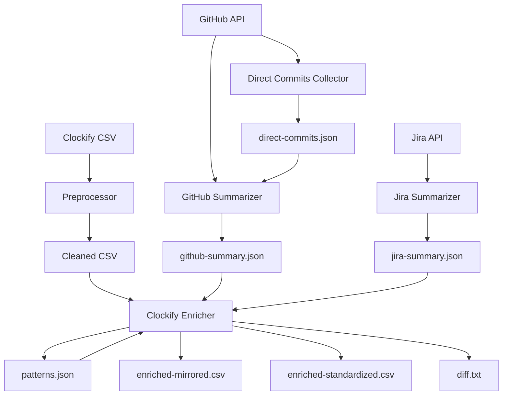

## Architectural Approach

### Core Pattern: Pipeline with Staged Caching

The system follows a **multi-stage pipeline architecture** where each stage is an independent CLI tool that reads from cache, processes data, and writes to cache. This design prioritizes:

- **Resumability**: Each stage can fail and resume without re-running previous stages
- **Cost efficiency**: Expensive AI calls are cached; re-runs are cheap
- **Testability**: Each stage can be tested independently with fixture data
- **Transparency**: All intermediate outputs are human-readable JSON files



### Key Architectural Decisions

**1. Script-First, AI-Second Philosophy**

All data fetching is pure scripting (GitHub API, Jira API, CSV parsing). AI is used only for:

- Grouping semantically related commits
- Generating human-readable summaries
- Pattern detection
- Writing professional descriptions

**Rationale**: Minimizes AI costs while maintaining quality where it matters (legal defensibility requires professional writing, not just data aggregation).

**2. File-Based CLI Provider Integration (Cross-Platform)**

AI providers are invoked via **file-in / file-out** executables in a local `cli-providers/` folder.

**Provider contract (portable):**

- Tool writes prompt to a file: `cache/prompts/prompt-{uuid}.txt`
- Tool executes the selected provider as an external process:
  - `provider <promptFile> <responseFile>`
- Provider writes the model response to `<responseFile>`
- Provider may optionally write `<responseFile>.meta.json` (best-effort metadata; e.g., tokens used if available)
- Prompt/response files are retained for debugging and legal auditability

**Cross-platform stance (Windows-friendly):**

- We will ship **official Node-based provider runners** (works on Windows/macOS/Linux)
- We will also allow optional shell providers (`.sh`, `.ps1`, `.bat`) for power users

**Rationale**: File-based execution is reproducible and easy to test. Shipping Node-based providers avoids `.sh` friction on Windows while keeping the “bring your own CLI” flexibility.

**3. Two-Phase Matching: Script Then AI**

Matching Clockify entries to GitHub/Jira follows a two-phase approach:

**Phase 1 (Script)**: Exact ticket ID matching

- Extract ticket IDs from Clockify descriptions (regex: `SD-\d+`, `PROJ-\d+`, etc.)
- Extract ticket IDs from GitHub PR titles, PR descriptions, commit messages
- Extract ticket IDs from Jira tickets (obviously)
- Match by exact ID overlap
- Also check for Jira ticket links in PR descriptions

**Phase 2 (AI)**: Semantic matching for unmatched entries

- For entries with no ticket ID matches, use AI to match based on:
  - Description similarity
  - Date proximity
  - Module/file overlap
  - Commit message keywords

**Rationale**: Exact matching is free and reliable. AI matching is expensive but handles edge cases. This hybrid approach maximizes accuracy while minimizing cost.

**4. Append-Only Cache with Resume (+ Consolidated JSON on Success)**

Each tool writes to cache incrementally:

- After processing each item (PR, ticket, entry), append to a working cache file (NDJSON)
- On resume, read NDJSON to determine last successful item, continue from next
- On successful completion, also write a **consolidated JSON** file (pretty-printed array) for human readability

**Rationale**: NDJSON enables exact resume after failures. Consolidated JSON makes outputs easy to inspect, diff, and reuse in ad-hoc analysis.

**5. Smart Batching for Enrichment**

Enrichment batches entries intelligently:

- **Primary strategy**: Smart batching by ticket/task (all entries referencing the same ticket IDs processed together)
  - Handles cases where Clockify entries, PRs, and commits contain **multiple ticket IDs**
- **Fallback**: If a ticket/task only has a single small entry (or no ticket IDs), batch by **day**
- **Batch size limit**: Max 10 entries per AI call (prevents context overflow)

**Rationale**: Ticket-based batching yields consistent narrative across multi-day work. Day-based batching covers misc tasks. The size limit prevents context overflow.

**6. Dual Output Generation**

The enricher produces two CSV outputs:

- **Mirrored**: Matches input schema exactly (for compatibility/submission)
- **Standardized**: Adds `AI_Confidence`, `AI_Notes`, `Split_Group_ID` columns (for review)

**Rationale**: Mirrored output is safest for legal submission (no schema surprises). Standardized output aids manual review with metadata. User chooses which to submit.

**7. Deterministic Timestamp Splitting**

When splitting a 6-hour entry (12:00 PM - 6:00 PM) into 3 sub-entries (2h, 3h, 1h):

- Sub-entry 1: 12:00 PM - 2:00 PM (2h)
- Sub-entry 2: 2:00 PM - 5:00 PM (3h)
- Sub-entry 3: 5:00 PM - 6:00 PM (1h)

Algorithm: Sequential time slicing where each sub-entry starts at previous end time.

**Rationale**: Deterministic and auditable. No overlaps, no gaps. Total time preserved exactly.

**8. Timezone Policy for Day Matching**

All “day-by-day” matching is done in the **machine’s local timezone** (Clockify CSV is treated as local time; GitHub/Jira timestamps are converted to local time before day bucketing).

**Rationale**: Simplest operationally and aligns with how the developer logged time. (We can add an explicit `timezone` config later if needed.)

**9. Token Estimation (Heuristic + Learning)**

Token estimation must not call AI. The tool will:

- Produce a rough token estimate using text-length heuristics and a stored coefficient
- Record observed usage per run in a local history file (best-effort): prompt length, response length, and (if provider supplies it) actual tokens
- Use accumulated history to refine the coefficient for future estimates

**Rationale**: Works with arbitrary CLIs while improving estimates over time. Accuracy is best when official providers emit usage metadata; otherwise estimates remain approximate but still useful for go/no-go confirmation.

### Technology Choices

- **Runtime**: Node.js (plain JavaScript, no TypeScript) - simplicity over type safety
- **GitHub API**: Octokit (`@octokit/rest`) - official, well-maintained
- **Jira API**: `node-fetch` for REST calls - minimal, no heavy client needed
- **CSV**: `csv-parse` + `csv-stringify` - battle-tested, handles edge cases
- **Date handling**: `date-fns` - lightweight, sufficient for this use case
- **AI**: Shell out to local CLI providers (official Node-based providers + optional shell providers) - flexible, supports any AI provider
- **Config**: Plain JSON file - simple, no dotenv needed

### Constraints

- **No database**: All data in files (JSON cache, CSV input/output)
- **No web server**: Pure CLI, no HTTP endpoints
- **No TypeScript**: Plain JavaScript for simplicity
- **Minimal dependencies**: Only essential libraries
- **Legal defensibility**: All decisions must be auditable and deterministic

---

## Data Model

### Config Schema

```json
{
  "github": {
    "personal_access_token": "ghp_...",
    "repo_owner": "company-name",
    "repo_name": "project-name",
    "main_branch": "develop",
    "developer_emails": ["user@company.com", "user@personal.com"],
    "date_from": "2024-01-01",
    "date_to": "2024-06-01"
  },
  "jira": {
    "base_url": "https://company.atlassian.net",
    "api_token": "...",
    "user_email": "user@company.com",
    "project_keys": ["SD", "PROJ"],
    "date_from": "2024-01-01",
    "date_to": "2024-06-01"
  },
  "clockify": {
    "input_csv": "./input/clockify-export.csv",
    "output_mirrored": "./output/enriched-mirrored.csv",
    "output_standardized": "./output/enriched-standardized.csv"
  }
}
```

**Notes**:

- `developer_emails` is an array (supports multiple commit emails)
- `main_branch` defaults to "develop" if not specified
- Date ranges are ISO format strings
- CLI args override config values

### Direct Commits Cache Schema

File: `cache/direct-commits.json` (NDJSON format)

```json
{"sha": "abc123", "date": "2024-03-15T14:30:00Z", "message": "fix auth bug", "files_changed": ["src/auth/login.js"], "lines_added": 15, "lines_removed": 8, "modules_touched": ["src/auth"]}
{"sha": "def456", "date": "2024-03-15T16:45:00Z", "message": "update tests", "files_changed": ["tests/auth.test.js"], "lines_added": 25, "lines_removed": 10, "modules_touched": ["tests"]}
```

**Notes**:

- One commit per line (NDJSON for append-only writes)
- `modules_touched` derived from file paths (e.g., `src/auth/login.js` → `src/auth`) (two-level with prefix)
- Filtered to only the developer’s commits on the configured main branch
- “Direct vs PR-derived” classification is performed later by the GitHub Summarizer by subtracting PR commit SHAs

### GitHub Summary Cache Schema

File: `cache/github-summary.json` (NDJSON format)

```json
{"type": "pr", "pr_number": 42, "pr_title": "Feature: User auth", "merged_at": "2024-03-15", "commits_count": 7, "files_changed": 12, "lines_added": 340, "lines_removed": 89, "review_iterations": 2, "modules_touched": ["src/auth", "src/api"], "commit_messages": ["add login", "fix bug"], "complexity_signal": "high", "ai_description": "Implemented user authentication including JWT tokens and session handling. Required two review rounds to address edge cases.", "ticket_ids": ["SD-140"]}
{"type": "commit_group", "date": "2024-03-16", "commits": [{"sha": "abc123", "message": "fix auth bug"}], "files_changed": 3, "modules_touched": ["src/auth"], "ai_description": "Fixed authentication bug in session middleware.", "ticket_ids": ["SD-141"]}
```

**Notes**:

- Mixed types: `pr` and `commit_group`
- `ticket_ids` extracted from PR/commit text (used for matching)
- `ai_description` generated by AI based on code changes, not PR description
- Commit groups created by AI semantic grouping

### Jira Summary Cache Schema

File: `cache/jira-summary.json` (NDJSON format)

```json
{
  "ticket_id": "SD-140",
  "title": "Implement user authentication",
  "type": "Story",
  "story_points": 5,
  "final_status": "Done",
  "description_summary": "Add login flow with JWT...",
  "back_to_development_count": 2,
  "status_history": [
    { "status": "In Progress", "date": "2024-03-10" },
    { "status": "Done", "date": "2024-03-15" }
  ],
  "comments_summary": "QA found edge case in session handling..."
}
```

**Notes**:

- `description_summary` is AI-compressed (~150 words)
- `comments_summary` only included if back-to-dev ≥ 1 or total hours > 10
- `status_history` used to explain why tasks took longer

### Patterns Cache Schema

File: `cache/patterns.json` (regular JSON, user-editable)

```json
{
  "build_tasks": {
    "variants": ["Build", "Generate build", "Create build", "Make build"],
    "suggested_standard": "Generate build",
    "count": 15
  },
  "standup_tasks": {
    "variants": ["Daily Standup", "Standup", "Daily sync"],
    "suggested_standard": "Daily Standup",
    "count": 45
  }
}
```

**Notes**:

- AI-generated but user-editable
- Used to standardize recurring task descriptions
- User can accept as-is or customize before enrichment

### Enriched CSV Schema (Standardized)

Columns:

- `Description` (enriched, professional)
- `Start Date` (MM/DD/YYYY)
- `Start Time` (HH:MM AM/PM)
- `End Date` (MM/DD/YYYY)
- `End Time` (HH:MM AM/PM)
- `Duration (h)` (H:MM format)
- `AI_Confidence` (high/medium/low)
- `AI_Notes` (e.g., "matched to PR #42, Jira SD-220, split 1/3")
- `Split_Group_ID` (UUID linking split entries from same original entry)

**Notes**:

- Mirrored output omits AI_Confidence, AI_Notes, Split_Group_ID columns
- Total hours per day must equal input total hours per day
- Split entries have sequential timestamps within original window

---

## Component Architecture

### Tool 1: Clockify Preprocessor

**Responsibility**: Clean Clockify detailed export to essential columns

**Inputs**:

- Raw Clockify CSV (from config or `--input` arg)

**Outputs**:

- `cache/clockify-cleaned.csv`

**Key Components**:

- CSV parser (validates required columns exist)
- Column filter (removes unnecessary columns)
- CSV writer

**No AI, no external APIs**. Pure data transformation.

---

### Tool 2: Direct Commits Collector

**Responsibility**: Fetch all developer commits present on the configured main branch (classification happens later)

**Inputs**:

- Config (GitHub credentials, repo, date range, main branch, developer emails)

**Outputs**:

- `cache/direct-commits.json` (NDJSON)

**Key Components**:

- GitHub API client (Octokit)
- Developer identity resolver (config emails or fetch from API)
- Commit filter (by author email only)
- Module extractor (derive modules from file paths)
- Append-only cache writer

**No AI**. Pure data collection.

---

### Tool 3: GitHub Summarizer

**Responsibility**: Fetch PRs, group direct commits, generate AI summaries

**Inputs**:

- Config (GitHub credentials)
- `cache/direct-commits.json`

**Outputs**:

- `cache/github-summary.json` (NDJSON)

**Key Components**:

- GitHub API client (fetch PRs, commits, reviews)
- Direct commits loader
- Ticket ID extractor (regex-based, from PR titles/descriptions/commits)
- AI grouping engine (groups related direct commits)
- AI summarization engine (generates `ai_description` for PRs and commit groups)
- CLI provider executor (file-based contract)
- Append-only cache writer with resume detection

**Script + AI hybrid**. Data fetching is scripted, grouping/summarization uses AI.

---

### Tool 4: Jira Summarizer

**Responsibility**: Fetch Jira tickets and generate AI summaries

**Inputs**:

- Config (Jira credentials, project keys, date range)

**Outputs**:

- `cache/jira-summary.json` (NDJSON)

**Key Components**:

- Jira API client (REST v3 with node-fetch)
- Ticket fetcher (by assignee, date range)
- Status history analyzer (detect back-to-development transitions)
- Comment fetcher (conditional: only if back-to-dev ≥ 1 or hours > 10)
- AI summarization engine (compress descriptions and comments)
- CLI provider executor
- Append-only cache writer with resume detection

**Script + AI hybrid**. Data fetching is scripted, summarization uses AI.

---

### Tool 5: Clockify Enricher

**Responsibility**: Match, split, and enrich Clockify entries using GitHub/Jira data

**Inputs**:

- `cache/clockify-cleaned.csv`
- `cache/github-summary.json`
- `cache/jira-summary.json`
- `cache/patterns.json` (after user review)

**Outputs**:

- `output/enriched-mirrored.csv`
- `output/enriched-standardized.csv`
- `output/diff.txt`

**Key Components**:

**Phase 1: Pattern Detection**

- Pattern analyzer (AI detects common task descriptions)
- Pattern generator (creates `patterns.json`)
- User confirmation prompt

**Phase 2: Matching Engine**

- Ticket ID extractor (from Clockify descriptions)
- Exact matcher (match by ticket IDs across all sources)
- Date-based matcher (match by date ±1 day window)
- AI semantic matcher (fallback for unmatched entries)

**Phase 3: Aggregation & Splitting**

- Multi-day aggregator (find all entries for same ticket across days)
- Task decomposer (AI creates synthetic sub-tasks with hour estimates)
- Time splitter (deterministic timestamp division algorithm)
- Pattern applier (standardize descriptions using patterns.json)

**Phase 4: Enrichment**

- Smart batcher (batch by ticket, fallback to day)
- AI enrichment engine (writes professional descriptions)
- Confidence scorer (high/medium/low based on match quality)
- Token estimator (heuristic + learning; no AI calls for estimation)

**Phase 5: Output Generation**

- Dual CSV writer (mirrored + standardized formats)
- Diff generator (side-by-side text comparison)
- Summary statistics calculator

**AI-heavy**. This is where the core value is created.

---

### Shared Utilities (`src/shared/`)

**Config Loader**

- Loads `config.json`
- Merges with CLI args (args override config)
- Validates required fields
- Provides defaults (e.g., `main_branch: "develop"`)

**CLI Provider Executor**

- Lists available providers from `cli-providers/` folder
- Prompts user for selection
- Executes provider script with file-based contract
- Handles errors (provider not found, execution failure)

**Cache Manager**

- Append-only NDJSON writer (working file for resume)
- Resume detection (check if cache exists, prompt user)
- Cache clearing (for `--force-refresh`)
- On success: emit consolidated pretty JSON (readability) in addition to NDJSON
- Atomic operations (write to temp, rename on success)

**Date Utilities** (using `date-fns`)

- Parse Clockify dates/times (MM/DD/YYYY + hh:mm AM/PM) as **local time**
- Parse ISO 8601 dates (GitHub/Jira) and convert to **local time**
- Date comparison (same local day, ±1 day window)
- Timestamp arithmetic (for splitting time windows)

**Ticket ID Extractor**

- Regex patterns for common ticket formats (SD-XXX, PROJ-XXX, etc.)
- Extract from text (descriptions, PR titles, commit messages)
- Returns array of ticket IDs found

**Module Extractor**

- Parse file paths to extract module names
- Strategy: Emit two-level module with prefix: `src/<module>` or `lib/<module>` (e.g., `src/auth/login.js` → `src/auth`)
- Handles edge cases (files in root, tests, etc.)

---

### Data Flow Example: End-to-End

**Scenario**: Enrich a Clockify entry "Shop (SD-220)" logged on 2024-03-15 for 6 hours

1. **Preprocessor**: Cleans CSV, outputs to cache
2. **Direct Commits Collector**: Collects all developer commits present on the main branch around 2024-03-15 (some may later be determined to be PR-derived)
3. **GitHub Summarizer**:

- Fetches PR #50 merged on 2024-03-15 (title: "Shop feature")

- Subtracts PR-associated SHAs (PR commit SHAs + PR merge commit SHAs) from the collected main-branch commits to isolate “direct” commit candidates
  - Groups remaining commits (AI determines which are related to shop)
  - Extracts ticket ID "SD-220" from PR description
  - AI generates: "Implemented shop UI, payment flow, and order history"

4. **Jira Summarizer**:

- Fetches ticket SD-220
- Story points: 8, back-to-dev count: 1
- AI summarizes: "Add e-commerce shop with product catalog, cart, and checkout"

5. **Enricher**:

- **Matching**: Finds exact match on ticket ID "SD-220"
- **Aggregation**: Checks if other days have SD-220 entries (finds 2 more days)
- **Splitting**: AI decomposes into sub-tasks:
  - Shop UI: 2.5h
  - Payment flow: 2h
  - Order history: 1h
  - Testing/debugging: 0.5h
- **Timestamp splitting**: Divides 12:00 PM - 6:00 PM into 4 sub-windows
- **Enrichment**: AI writes professional descriptions for each sub-task
- **Confidence**: High (exact ticket match, PR match, Jira data available)

6. **Output**: 4 rows in enriched CSV, total 6 hours preserved

---

### Failure Modes & Recovery

**GitHub API rate limit**:

- Tool saves progress to cache (last successful PR)
- Shows error: "GitHub rate limit exceeded. Resume in 1 hour."
- On resume, continues from next PR

**AI provider failure**:

- Tool saves progress (last successful summary)
- Shows error: "AI provider failed: [error]. Check cli-providers/ script."
- On resume, retries failed item

**Invalid config**:

- Tool validates config on startup
- Blocks with clear error: "Missing required field: github.personal_access_token"
- User fixes config, re-runs

**Missing cache files**:

- Tool checks dependencies on startup
- Blocks with clear error: "Run collect-direct-commits.js first"
- User runs prerequisite tool

**Date range mismatch**:

- Tool detects mismatch, prompts to update config
- User can choose to continue (low confidence) or fix and re-run

All failures are recoverable. No data loss. Clear error messages guide user to resolution.
